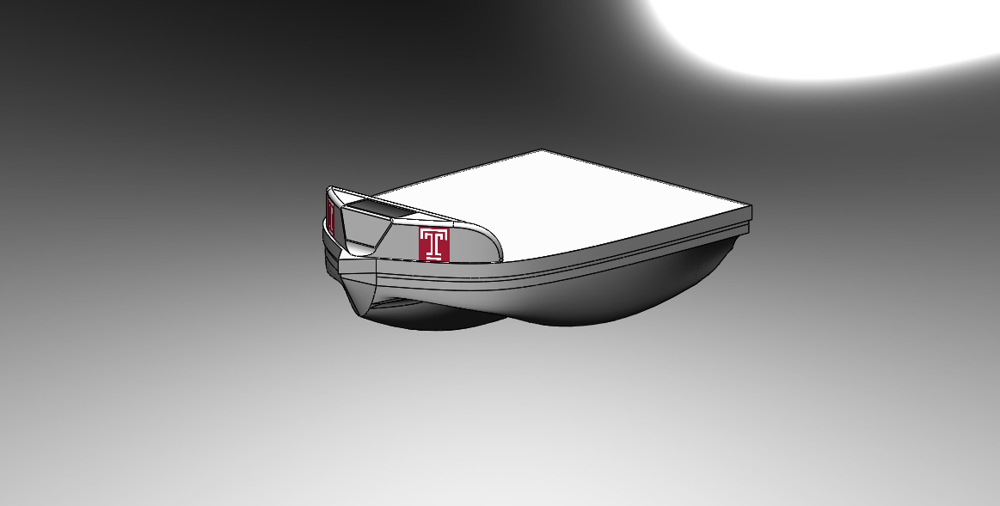
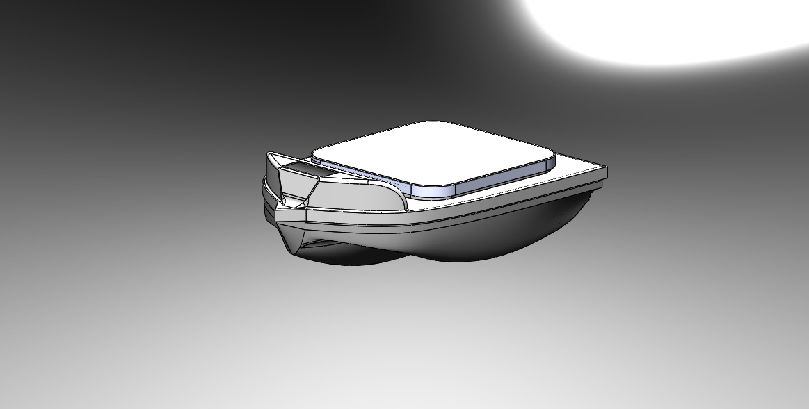

## The files contained in this directory were sent to Viking Yachts who manufactured the hull. ##

There seem to be two versions of the boat. 

The one below, "NoHeliHole", is the one that was actually made. 

The other version shown below, "WithHeliHole", seems to be another version that was considered but not used.

I've included all SolidWorks files here because I am not familiar with the program and I don't know if there are any dependencies between the versions.
